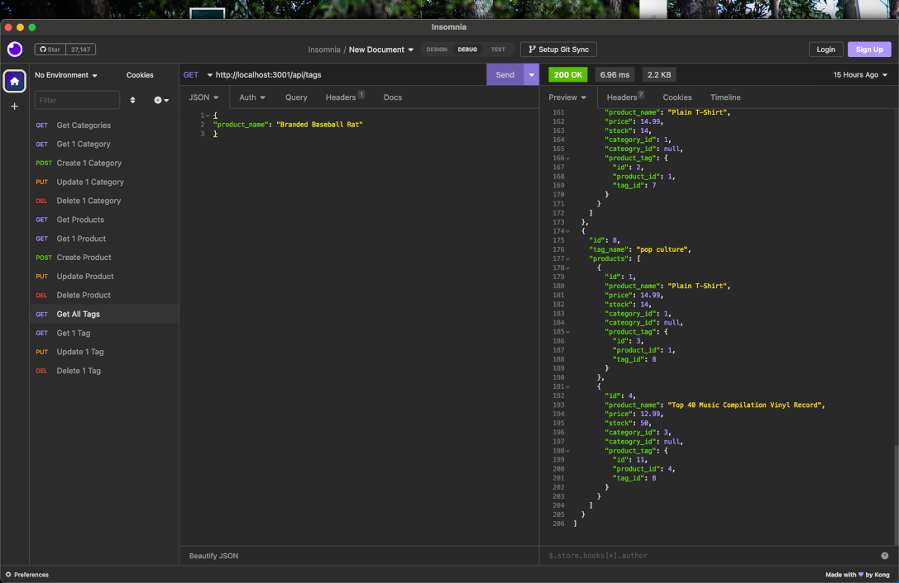

# e-commerce back end 

## Table of Contents

### [Description](#Description)

### [Installation](#Installation)

### [Usage](#Usage)

### [Testing](#Testing)

### [Contributors](#Contributors)

### [License](#License)

### [Questions](#Questions)

## Description

This is the back end of an e-commerce website, it handles crud routes for inventory

## Installation

This isn't a fully functional program, it only serves as an excercise in backend api routes. To use it, you need to download the repo and launch the server, then interact with it with a third party api software like Insomnia or Postmate

## Usage

Download the repo, launch the server, then make get post put and delete requests to it through Insonia Core. A walkthrough video can be viewed here: https://drive.google.com/file/d/1IHfeSsoYeKye1sCfeM-2vy-xIR516TQN/view

## Testing

Play with it in insomnia to see if all the routes work, also feel free to write extensive tests with JEST and make a pull request to my repo with them

## Contributors

Starter code was provided by the Columbia University Coding Bootcamp program, but my assignment was to flesh out the models and api routes

## License

This is the back end of an e-commerce website, it handles crud routes for inventory

## Questions

Philip Scott Neumann

https://github.com/moviefan322

philman202@yahoo.com
